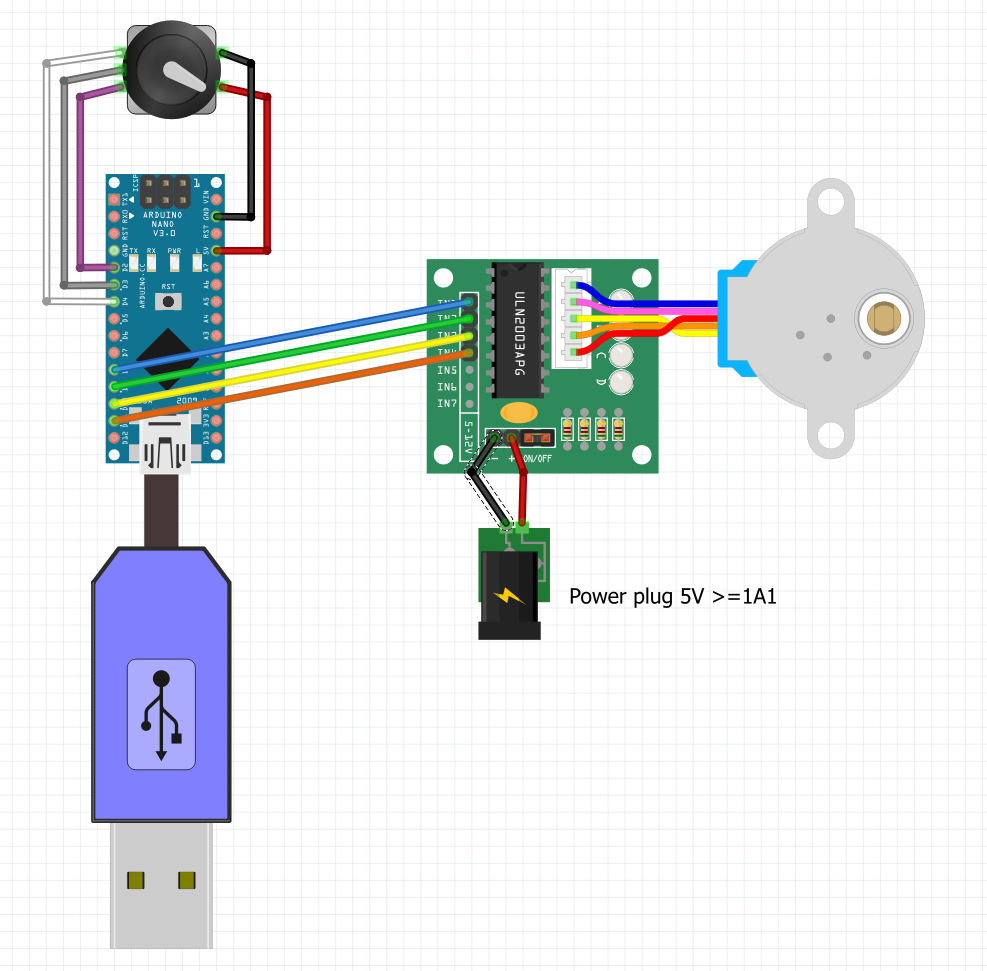
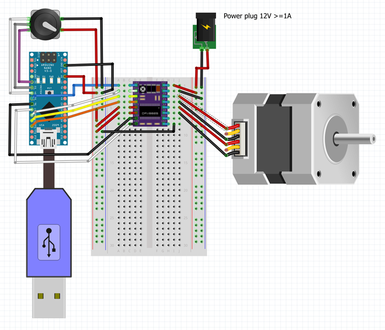
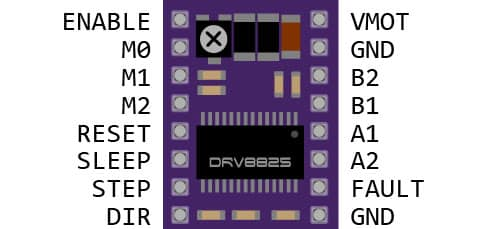

# DRV8825Motor

NEMA17 with DRV8825 and 28BYJ-48 Stepper Motor with ULN2003

This sketch can be used for both motor types. 
With a #define the motor type / driver is selected.

```
// ********************************* select only NEMA or BYJ
//#define NEMA
#define BYJ
// **********************************
```
A KY-040 rotary encoder controls the microstepper mode and rotation speed. 
The motor will start running when the rotary shaft is turned left or right in- or decreasing rotor speed.

Microstepping mode can be selected by pressing the shaft. 
When the motor is not running smoothly try a higher microstepping mode. 
Motor speed will then decrease and step precision increase.

The motor can be stopped immediatly by pressing the shaft >1 second.
```
ULN2003 
Driver Board	Connection
IN1	            Pin 8 Arduino
IN2	            Pin 9 Arduino
IN3	            Pin 10 Arduino
IN4	            Pin 11 Arduino
–	            GND power supply
+	            5 V power supply
```

The motor power supply is 5V and be connected to + and GND to -. 
A USB 5V power supply of 1A is sufficient to drive the motor.
The stepper motor coils M0-M4 are connected with a connector.

The Arduino is powered via the USB-cable.
IN1-IN4 are connected to pin 8, 9 ,10 and 11.
In a definitive setting it is wise to connect GND of the Arduino to - (GND) of the driver board. 

<br />

The rotary encoder is connected to Arduino pin: 2 - CLK, 3 - DT, 4 - SW, + to 5v and - to GND
```
CLK	            Pin 2 Arduino
DT 	            Pin 3 Arduino
SW 	            Pin 4 Arduino
–	            GND pin Arduino
+	            5V  pin Arduino
```
<br />

```
DRV8825 Connections
DRV8825	Connection
VMOT	8 - 45 V
GND	    Motor ground
SLP	    5 V
RST	    5 V
GND	    Logic ground
EN      Pin 5
DIR	    Pin 6
STP	    Pin 7
M0      Pin 8      // microstep pin
M1      Pin 9      // microstep pin
M2      Pin 10     // microstep pin
A1, A2, B1, B2	Stepper motor
```
The motor power supply is connected to VMOT and GND (top right).
Stepper motor coils are connected to A1, A2, B1, and B2 as indicated in the pinout diagram.

<br />

The GND pin (bottom right) must be connected to the microcontroller ground reference. 
VDD is connected to the 5 V logic supply.
The STP (step) and DIR (direction) pins are connected to digital pins 3 and 2, respectively. 
Alternate digital pins may be used if defined accordingly in software.

The RST (reset) and SLP (sleep) pins must be tied to 5 V to enable the driver.
The EN (enable) pin is internally pulled low and is connected to pin 5. When driven high, the driver is disabled and the motor can be turned freely. Otherwise it will stay powered and the shaft is difficult to rotate by hand.

The FAULT output is an open-drain signal that asserts low when the H-bridge FETs are disabled due to overcurrent protection or thermal shutdown. This pin is not utilized in this configuration.
